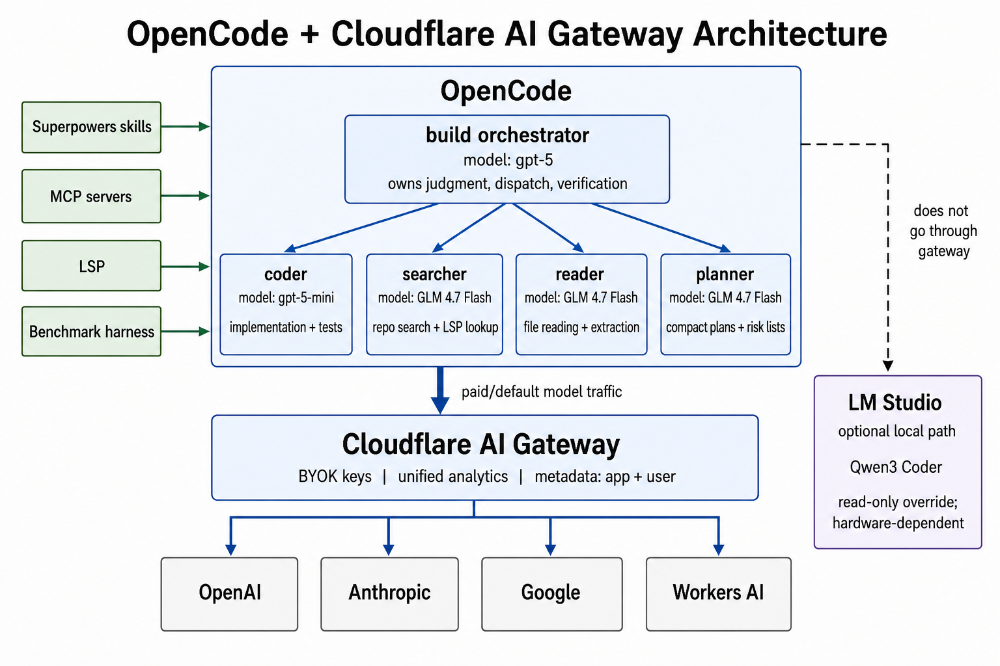

# Architecture

> **Pricing note:** dollar figures below are "as of May 2026" and indicative only. They exist to convey rough order-of-magnitude differences between tiers, not as a current rate card. Always check each provider's published pricing before making cost decisions.

## Current Shape

This repo is no longer a simple "local, cheap, frontier" ladder. I tested that version, and it was too blunt. The current setup is reliability-based:

- `build` is the primary orchestrator on `openai-via-gateway/gpt-5`.
- `coder` is the implementation worker on `openai-via-gateway/gpt-5-mini`.
- `searcher`, `reader`, and `planner` are cheap hosted workers on `workers-ai-via-gateway/@cf/zai-org/glm-4.7-flash`.
- `local` is optional and hardware-dependent. It points at LM Studio, not Ollama, and is useful only if local inference is fast enough on your machine.
- Superpowers is already wired through the OpenCode plugin mechanism; the orchestrator uses skills when they apply.
- MCPs and LSP are part of the working setup, not future add-ons.

The important lesson from the benchmark work is simple: cheap is only useful when the model is reliable for that role. GLM is fine for bounded search/read/planning work. It was not reliable enough as the default implementation coder on the harder markdown-editor benchmark.

## Request Flow



All paid model traffic goes through Cloudflare AI Gateway. The optional LM Studio path is local and does not show up in gateway analytics.

## Provider Shape

The gateway is the default control plane. Provider API keys live in Cloudflare BYOK, not on each developer machine. OpenCode authenticates to the gateway with `CF_AIG_TOKEN`, and the gateway forwards requests to the right upstream provider.

## Model Roles

| Role | Model | Why |
|---|---|---|
| `build` | `openai-via-gateway/gpt-5` | Keeps judgment, ambiguity handling, fallback decisions, integration review, and final user-facing accountability on the strongest configured model. |
| `coder` | `openai-via-gateway/gpt-5-mini` | Best current balance of reliability and cost for implementation. It passed the markdown-editor benchmark where GLM failed. |
| `searcher` | `workers-ai-via-gateway/@cf/zai-org/glm-4.7-flash` | Cheap and sufficient for repository discovery, grep/glob/LSP lookup, and file inventory. |
| `reader` | `workers-ai-via-gateway/@cf/zai-org/glm-4.7-flash` | Cheap and sufficient for reading local files and extracting facts when scope is clear. |
| `planner` | `workers-ai-via-gateway/@cf/zai-org/glm-4.7-flash` | Cheap and sufficient for compact plans, risk lists, and decomposition when the task is narrow. |
| `local` | `lmstudio/qwen3-coder-30b-a3b-instruct` | Optional read-only local path. It works with the right runtime/model/context setup, but it was too slow on my hardware to be my daily driver. |

## Why One Gateway

The gateway gives me five things direct provider connections do not:

| Capability | Why it matters |
|---|---|
| Unified analytics | Every paid request appears in one dashboard with model, tokens, cost, and latency. |
| Per-user attribution | `cf-aig-metadata` tags each request with `{app, user}`. |
| BYOK key storage | Provider keys live in Cloudflare settings, not on each machine. |
| Caching | Identical requests can be cached by the gateway. |
| Rate limits and fallback | Spend control and fallback behavior can live outside the client. |

The cost is one extra network hop. In practice that has been worth it because it turns model routing and spend into something visible.

## Provider Configuration

Each upstream gets its own OpenCode provider entry. The current example config uses provider-native SDKs wherever possible and points them at Cloudflare's per-provider gateway endpoints:

| Provider key | npm package | Gateway endpoint |
|---|---|---|
| `anthropic-via-gateway` | `@ai-sdk/anthropic` | `/anthropic` |
| `openai-via-gateway` | `@ai-sdk/openai` | `/openai` |
| `google-via-gateway` | `@ai-sdk/google` | `/google-ai-studio/v1beta` |
| `workers-ai-via-gateway` | `@ai-sdk/openai-compatible` | `/workers-ai/v1` |
| `lmstudio` | `@ai-sdk/openai-compatible` | `http://127.0.0.1:1234/v1` |

Using the provider-native SDKs matters. OpenAI reasoning models, Anthropic models, and Google models all have provider-specific request shapes. The OpenAI-compatible adapter is useful where the endpoint really does speak that shape, but it is not a universal compatibility layer.

OpenCode sends the model **key** to the upstream API. Per-provider endpoints accept bare model names such as `gpt-5` and `claude-sonnet-4-5`. The Workers AI endpoint uses Workers AI model IDs such as `@cf/zai-org/glm-4.7-flash`.

## Authentication

All gateway-routed traffic uses:

```text
Authorization: Bearer ${CF_AIG_TOKEN}
```

The gateway recognizes that as gateway auth, strips it before forwarding upstream, and substitutes the provider key stored in BYOK. No OpenAI, Anthropic, or Google API keys need to live in the local OpenCode config.

Do **not** also send `cf-aig-authorization`. The gateway can forward unknown auth-looking headers upstream, and providers may reject them.

## Attribution

The example config includes `plugins/sync-user-env.js`, which injects a `cf-aig-metadata` header into every gateway-routed provider at OpenCode startup:

```json
"headers": {
  "cf-aig-metadata": "{\"app\":\"<repo-or-directory>\",\"user\":\"<user-tag>\"}"
}
```

The setup uses two local environment variables as inputs:

- `OPENCODE_USER_TAG`: set once, usually to your OS username or short handle.
- `OPENCODE_APP_TAG`: set by the shell hook from [SETUP.md](SETUP.md#6-recommended-automatic-per-user-and-per-project-attribution), or computed by the plugin from the nearest git root when missing.

The app tag walks up to the nearest `.git` directory and uses that directory name. So `~/code/auth-api/src/components` still reports as `auth-api`. Once OpenCode starts, the plugin writes the final metadata header for that session.

This is intentionally simple. If org-scale attribution ever matters, a hook or plugin could record a git remote slug such as `myorg/auth-api` instead.

## Tooling Layers

The model routing is only one part of the setup. The surrounding tools are what keep the cheaper paths honest:

| Layer | What it adds |
|---|---|
| MCP servers | Current docs, security scanning, and browser verification. See [MCP-INTEGRATION.md](MCP-INTEGRATION.md). |
| LSP | Symbol lookup and diagnostics without dumping whole files into context. See [LSP-INTEGRATION.md](LSP-INTEGRATION.md). |
| Superpowers | Process skills such as TDD, brainstorming, debugging, and verification. Already wired through the OpenCode plugin entry. |
| Benchmark harness | Evidence that routing happened and output still passed deterministic checks. See [benchmarks/README.md](../benchmarks/README.md). |

Superpowers belongs on the orchestrator, not the cheap workers. The plugin loads the skills, and the `build` prompt tells the orchestrator to use them when they apply while keeping delegated subagent tasks concrete and bounded.

## Worker Boundaries

The worker split is deliberately conservative:

- `searcher` finds files, symbols, and local references.
- `reader` extracts facts from files.
- `planner` drafts compact plans or risk lists from bounded context.
- `coder` makes scoped edits and runs specified checks.
- `build` owns final judgment.

Subagents do not coordinate with each other, decide whether the overall task is done, or broaden scope. The orchestrator gives them the objective, context, scope, expected output, and success criteria, then verifies the result before treating it as true.

The retry rule is intentionally simple: retry a worker once only when the failure looks like missing context. Otherwise, escalate to the primary agent or a stronger path instead of looping.

## Local Models

Local models are optional. I did get local tool-calling working, but only with the right runtime, model, context size, and tool-call format. The working path was LM Studio + Qwen3 Coder + a larger context window. On my hardware, local subagent calls were still too slow to be the daily driver.

That is why local is a manual override, not part of the required setup. If your hardware is better, the architecture can use it. If not, the cost-saving thesis still works through hosted cheap workers behind the gateway.
